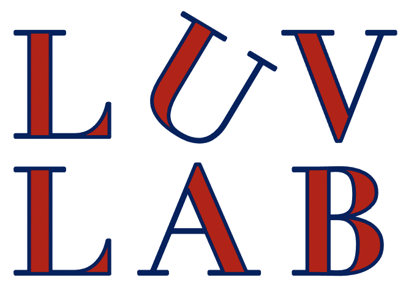

# LUV Lab Training Materials

Self-serve research-training materials from the **Language Use and Variation (LUV)
Lab** at Villanova University — [luv-lab.info](http://luv-lab.info). The lab studies
sociolinguistics, bilingualism, cognition, and computational models of language
adaptation, and trains undergraduate and master's researchers to do real research:
research ethics, acoustic measurement, forced alignment, and running EEG experiments
end to end.

These are the lab's actual onboarding modules, published for our students and for
anyone else who finds them useful.

## Start here

**[`training/README.md`](training/README.md)** is the index: what each module covers
and its review status. Each module is self-contained — purpose, outline, hands-on
exercises with answer keys, and a competence check.

| Area | Modules |
|---|---|
| Research ethics & data privacy | Data ethics & privacy for research assistants |
| Acoustic analysis | Praat / acoustic measurement basics · Forced alignment (MFA) |
| EEG | Session skills (capping, impedances, running participants) · Running the lab's EEG pipeline |

`training/practice-data/` and `training/practice/` hold the fixtures the exercises
use — **all synthetic or derived from openly licensed public datasets (OpenNeuro
ds007069, CC0); no participant data from the lab's own studies appears anywhere in
this repository.** Further modules from the internal sequence (transcription and
anonymization, R) are being prepared for release.

## About this repository

This is a **read-only public mirror**, exported from the lab's internal repository
by a gated publish pipeline: every publish stages an explicit allowlist and refuses
unless automated checks pass (credential patterns, personal names, internal tokens,
unexpected file types), then records a SHA-256 manifest of the exact published tree
(`PUBLISH-MANIFEST.sha256`). Direct changes and pull requests here won't be merged —
changes happen upstream. Found a problem or have a suggestion? **Please open an
issue.**

Some documents reference internal lab files (the lab handbook, project records,
modules not yet released); those references intentionally do not resolve here. Notes
marked `[confirm]` are the lab's own convention for facts pending verification —
honesty markers, not errors.

Last published from internal revision `0fa324c8` on 2026-09-04.

## Licensing

- **Training materials** (all documents and data files): [Creative Commons
  Attribution 4.0 International (CC BY 4.0)](LICENSE) — reuse and adapt freely with
  attribution to *the LUV Lab, Villanova University* and a link to
  [luv-lab.info](http://luv-lab.info).
- **Script files** (`.py`, `.praat`, `.sh` — the practice-data generators and
  helpers): [MIT](LICENSE-MIT).
